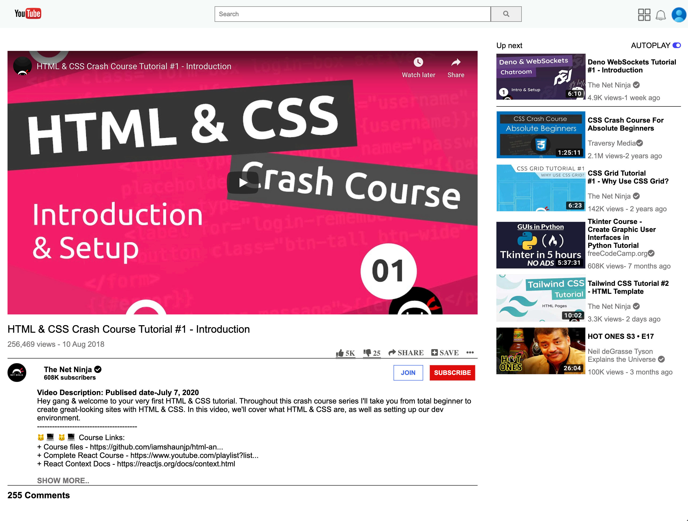

# HTML & CSS: Embedding Images & Video 

> In this project we created a clone of a YouTube webpage. 

## Built With

- HTML
- CSS

## Live Demo

[YouTube Clone](https://dcronan.github.io/YouTube/)

## Authors

👤 **Daniel Ronan**

- Github: [@DcRonan](https://github.com/DcRonan)
- Linkedin: [Daniel Ronan](https://www.linkedin.com/in/danronan10/)

👤 **Lamia Sristy**

- Github: [@LamiaSristy](https://github.com/LamiaSristy)

## Show your support

Give a ⭐️ if you like this project!

## 📝 License

This project is [MIT](lic.url) licensed.
